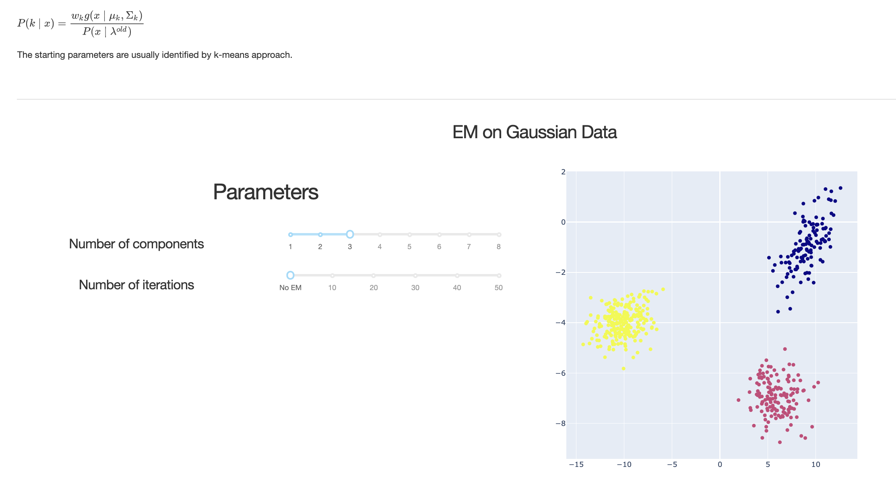

# EM for HMM and GMM

ORIGINAL REPO at
[https://github.com/maelfabien/EM_GMM_HMM](https://github.com/maelfabien/EM_GMM_HMM)

This is a Dash web application dedicated to illustrations of EM for HMM and GMM.

## Files

- `app.py` : the core app component in Dash
- `countours.py` : functions to generate GMMs contour plots
- `datagen.py` : a random GMM data generation function
- `description_gmm.md` : text that goes into the explanation of the GMMs
- `gmm.py` : a version of the GMM implemented by hand
- `Procfile` : a file containing the launch phrase for the app
- `requirements.txt` : the list of requirements for the file
- `streamlit` : a folder containing Streamlit web application
- `images` : external images used
- `gender` : a folder for the gender prediction algorithm
  - `female.npy` : 2 MFCC features extracted on female trainings (AudioSet)
  - `male.npy` : 2 MFCC features extracted on female trainings (AudioSet)
  - `clips` : folder containing 2 wav files from AudioSet (Male and Female)

## How to use it?

- Clone the repo
- Install Anaconda3 (Tested with conda 22.11.1)
- `conda env create -f environment.yml -p /home/user/anaconda3/envs/emgmm`
- `python app.py`
- Open the link in browser
